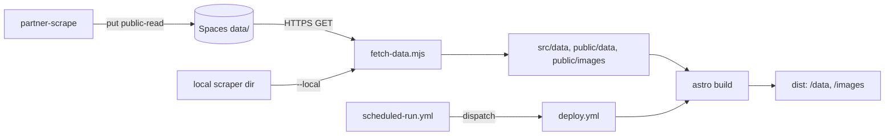

# Architecture Update -- Sprint 039: Build the site from the bucket

## What Changed

- **Bucket Store (scraper/partner_scrape/storage.py)**: writes under `data/`
  carry `ACL=public-read`; `cache/` writes unchanged (private).
- **ACL backfill tool**: one-time script setting public-read on existing
  `data/` objects.
- **Data fetcher (new, scripts/fetch-data.mjs)**: downloads published data
  over HTTPS (or copies from `--local`) into build inputs; validates.
  Replaces scripts/fetch-data.sh.
- **Build hooks (package.json)**: `predev`, `prebuild` invoke the fetcher.
- **Git tracking**: generated files untracked and gitignored.
- **Workflows**: deploy.yml unchanged in shape (fetch happens in prebuild);
  scheduled-run.yml triggers deploy after a successful scrape.

Fetch order (no listing needed): root files (`partners.json`, `teams.json`,
`places.json`, `clubs.json`, `opportunities.json`, `scrape-meta.json`,
`ads.json`, `yield-history.json`) -> per-partner `events_url` /
`past_events_url` from the partners envelope -> images referenced by
`image_src` in opportunities and partner events. `SCHEMA.md` is skipped
(or fetched to public/data if the data-access contract lists it; ticket 003
confirms). Mapping preserved from fetch-data.sh: opportunities, scrape-meta,
ads, yield-history -> src/data only; teams/places/clubs -> src/data and
public/data; partners.json envelope -> public/data only.

## Why

Issue 69: static site should build from published data, not committed copies.

## Impact on Existing Components

- Pages/components keep `import` of `src/data/*.json`; unchanged.
- `/data-access`, `/for-agents`, `llms.txt` URL contract unchanged; wording updated.
- Scraper `--site-dir` option: ticket 002 checks it does not write the now-ignored paths in a way that conflicts.
- Dependency direction: fetcher depends only on bucket URL + filesystem; Astro depends on fetcher output, not vice versa. No cycles.

## Migration Concerns

- Backfill must complete before the first bucket-fetching build.
- Untracking (`git rm --cached`) happens only after the fetcher works, so master is never unbuildable.
- Fetch writes into files that are gitignored; the fetcher mirrors (deletes stale partner dirs/images) as the old rsync --delete did.
- Deploy trigger needs `actions: write` on scheduled-run (workflow_dispatch of deploy.yml via gh CLI) since GITHUB_TOKEN pushes do not trigger workflows.

## Design Rationale

- **Node script over bash**: no aws/rsync/python needed on CI or Windows; `fetch` built into Node 22. Alternative (curl bash) rejected: JSON-driven file list and integrity check are clumsy.
- **Derive file list from JSON, not listing**: avoids needing public ListBucket.
- **Download into build inputs vs. Astro integration**: keeps existing static imports and `public/` serving untouched; smallest change.
- **public-read ACL vs bucket policy**: ACL keeps control in code; policy is fallback (stakeholder action).

## Open Questions

1. Can the scoped DO key set object ACLs? Ticket 001 decides; if not, stakeholder must add a public-read bucket policy on `data/*` in the DO console, and ticket 002 reduces to the Store change being unnecessary.
2. Should a dev re-fetch on every `npm run dev`, or skip if files exist (with `--force`)? Plan: fetch always but fast; skip flag via `SKIP_FETCH=1`.
3. Is SCHEMA.md part of the public contract?
