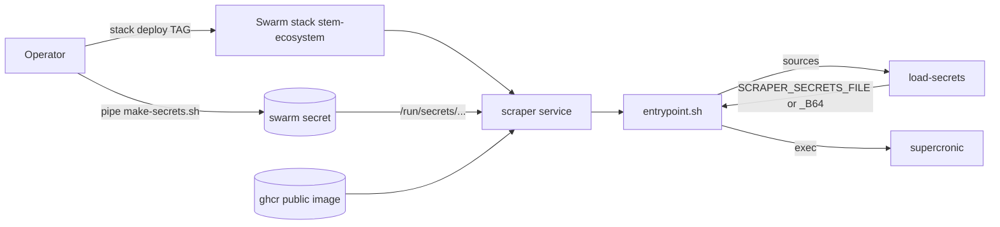

<!-- CLASI: Before changing code or making plans, review the SE process in CLAUDE.md -->

# Architecture Update -- Sprint 041: Deploy the scraper to the swarm

## What Changed

Adds a deployment descriptor at the repo root and a file-based input to the
secrets loader. No change to `partner_scrape`.

- `docker-compose.yml` (repo root, new): swarm stack file. One service `scraper`; image `ghcr.io/league-infrastructure/stem-ecosystem-scraper:${TAG:-latest}`; `build:` from `scraper/docker/Dockerfile`; external secret `stem-ecosystem_scraper_secrets`; env `SCRAPER_SECRETS_FILE`; tmpfs `/dev/shm` (~1 GB); healthcheck; `deploy.restart_policy`; memory limit. Boundary: deployment config only.
- `scraper/docker/load-secrets` (modified): bundle source is now the file named by `SCRAPER_SECRETS_FILE`, else the env var. Boundary: parsing only.
- `scraper/docker/README.md` (modified): swarm deploy procedure.

Dependencies stay acyclic: compose -> Dockerfile/image -> entrypoint -> load-secrets.

## Why

Issue 71 and the 2026-10-08 stakeholder approval: run the scraper on the League swarm, public image, swarm secret, manual deploy.

## Impact on Existing Components

- `load-secrets`: additive; env-var behavior unchanged, so `docker run` use is unaffected.
- Dockerfile: unchanged (healthcheck lives in compose; arch handled by existing `TARGETARCH`).
- Site `deploy.yml`: untouched.

## Migration Concerns

None for data. The secret is created once on the swarm; rotating means create a new secret under a new name/version and redeploy (swarm secrets are immutable).

## Design Rationale

**Decision: swarm secret mounted as a file, via `SCRAPER_SECRETS_FILE`.** Context: swarm secrets are files, and env-var secrets would be visible in `docker service inspect`. Alternatives: env var in the stack file (leaks, and env files are disallowed), one swarm secret per key (more plumbing, diverges from `make-secrets.sh` bundle). Why: reuses the existing bundle and parser. Consequences: one secret to rotate.

**Decision: public ghcr image.** The image holds no secrets (sprint 040) so public avoids registry-credential management; stakeholder-approved.

**Decision: tmpfs `/dev/shm` instead of `--ipc=host`.** Swarm does not support host IPC; Chromium crashes with the 64 MB default.

**Decision: manual stack deploy.** league-network's release automation is not built; a build workflow is deferred.

## Self-Review

- Consistency: Sprint Changes match body.
- Codebase alignment: Dockerfile already multi-arch (supercronic checksums) and `load-secrets` is the single parsing point.
- Design quality: each module one concern; no cycles; no anti-patterns.
- Risks: arm64-built image would fail on x86 nodes (mitigated: explicit `--platform linux/amd64`); no placement constraint so the task may move nodes (acceptable; state is in the Spaces bucket).
- Verdict: **APPROVE**.

## Open Questions

None.
