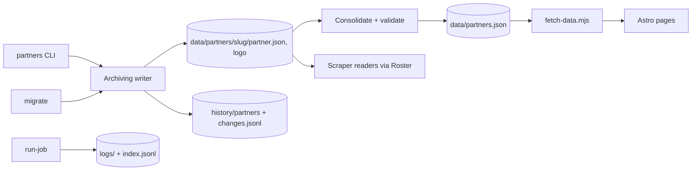

# Architecture Update -- Sprint 042: Partner records in the bucket, and run logs

## What Changed

New module `partner_scrape/partners/` (Partner Record Store):
- `records.py` -- read/list/validate records (`data/partners/<slug>/partner.json`), `Roster` loader used by all scraper readers.
- `writer.py` -- the single archiving writer for records and logos (archive, write, append `history/partners/changes.jsonl`).
- `consolidate.py` -- list + validate + merge events urls -> `data/partners.json`.
- `migrate.py` -- one-time import (split roster, logos, copy partner_log), plus equality verification.
- CLI group `partners get|put|add|consolidate|migrate|verify-migration`.
New `docker/run-job` logging wrapper and `partner_scrape/logs.py` (upload + index) -- Run Log Capture.
Changed: `export/publish.py` (roster written by consolidation, not hand-built), `export/partner_log.py` (prefix `history/partner_log`), `normalize`, `directory`, `registry/validate_roster.py`, `pipeline.py`, `cli.py` (read roster from Roster loader), Dockerfile, `scripts/fetch-data.mjs`, `.gitignore`.

Dependency direction: CLI/scraper/migrate -> writer/records -> Store. Consolidate depends on records and validate_roster; no cycles. Site depends only on public data files.

## Why

Issue 77 (bucket as source of truth) and issue 72 (run logs); see sprint.md.

## Impact on Existing Components

- Store: `logs/` and `history/` must not get public-read; the writer/log code pass `public_read=False` explicitly (check S3Store default and the data-store config, per issue 72).
- Slug is read from the record; `model.slugify` stays only for migration and `partners add`.
- validate_roster currently reads a JSON file path; it gets a list-of-records entry point.
- Site: pages continue importing `src/data/partners.json`, now a gitignored file produced by fetch-data (justification in sprint.md); no page edits needed beyond possibly none.

## Migration Concerns

- Copy, never move/delete `cache/partner_log` (deployed image still writes it until redeploy). Pre-redeploy runs will write new events to the old prefix; the team lead re-runs the copy (idempotent) just before cutover/after redeploy.
- Image rebuild required; old image keeps reading its baked roster until redeployed and does not touch data/partners/<slug>/partner.json, but overwrites data/partners.json with its own baked-roster version on its next scrape, so redeploy before Monday 03:00 PT or re-consolidate afterwards.
- Real migration only via the team-lead checklist.

## Design Rationale

- Decision: logos in `data/partners/<slug>/` with fetch-data copying to `/images/logos/`. Alternatives: serve from bucket URL (cross-origin, page churn, breaks offline build). Consequence: build needs the fetch step it already has.
- Decision: one writer for records and logos so history cannot be bypassed; bucket versioning is a backstop.
- Decision: consolidation fails loudly rather than skipping a bad record.

## Open Questions

- Format of `logo_src` in `partner.json` (bucket-relative chosen). Ticket 005 must check current logo_src shapes and any non-local ones.
- Actor naming in changes.jsonl: `person:<name>`, `haiku`, `migration` (free-form string, CLI `--by`, default `$USER`).

## Self-review verdict: APPROVE WITH CHANGES
Consistent, no cycles, cohesive modules. Watch item: ensure public_read defaults for history/logs (ticket 001/002 tests assert it).
