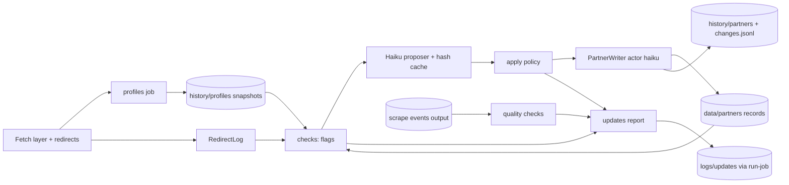

# Architecture Update -- Sprint 043: Partner profile scrape and automatic record updates

## What Changed

- `fetch/fetcher.py`, `fetch/headless.py`, `fetch/cache.py`: `FetchResponse` gains `final_url` and `redirect_chain` (list of `[status, url]`); cache entries store them; new pure helper `is_notable_redirect(requested, final)`. Plain fetcher captures the chain through a redirect-recording handler; headless uses the navigation's final URL. A small `RedirectLog` collector (in `fetch/redirects.py`) records notable redirects per run for reports. Backward compatible: older cache entries without the fields load with `final_url == url`.
- New package `partner_scrape/profiles/`:
  - `discover.py` -- find About/Contact pages from nav links and sitemap.
  - `extract.py` -- pure no-LLM fact extraction (title, og:site_name, JSON-LD, socials, mailto/tel).
  - `snapshot.py` -- snapshot model + private store read/write (`history/profiles/<slug>/profile.json`).
  - `job.py` -- the `profiles` job (iterate roster, fetch via PoliteFetcher, write snapshots, report).
- New package `partner_scrape/updates/`:
  - `checks.py` -- no-LLM change check producing flags with severity.
  - `proposer.py` -- Haiku client (`claude-haiku-4-5-20251001`), JSON-schema output, content-hash cache (`cache/updates/<slug>/<hash>.json` in the scrape-cache store), fake for tests.
  - `policy.py` -- apply policy: confidence threshold, no blanking, immutable slug/id, field allowlist, per-run cap.
  - `quality.py` -- event-quality checks over existing scrape output (report-only).
  - `job.py` -- orchestrates check -> propose -> policy -> `PartnerWriter.put_record(actor="haiku")` -> consolidate -> report; `--dry-run`, `--no-llm`, `--max-changes`.
- `cli.py`: subcommands `profiles` and `updates`. `logs.py`: `LOG_TYPES` gains `profiles`, `updates`. `docker/run-job`, `crontab`, Dockerfile/README updated.

Dependencies: updates -> profiles snapshots (read), partners writer/records, fetch cache; profiles -> fetch, partners records (roster). No cycles; `partners/` does not depend on either new package. Fan-out of `updates/job.py` is 5 (checks, proposer, policy, quality, writer) -- it is the orchestrator by design.

## Why

Issues 73-76; stakeholder decision to make the bucket record the source of truth and apply updates automatically with safeguards.

## Impact on Existing Components

- Fetch layer: additive fields; every adapter unchanged. Cache entry format additive.
- `PartnerWriter` is reused unchanged; actor string `haiku` already anticipated.
- `history/` stays private (snapshots go there); new cache prefix `updates/` is in the scrape-cache store, private.
- `run-job`: new job names, required secrets: `profiles` -> DO keys only; `updates` -> DO keys + ANTHROPIC_API_KEY (waived only with `--no-llm`).
- Crontab Sunday 03:00 / 05:00; no overlap with Mon/Thu scrape.

## Migration Concerns

None for data. Image rebuild and swarm redeploy needed (team lead, ticket 009). Old cache entries lack redirect fields (treated as no redirect until refetched).

## Design Rationale

- Decision: snapshots private under `history/profiles/`. Context: they contain scraped third-party contact data and are an internal comparison input. Alternative: public `data/profiles.json`. Why: nothing on the site consumes them; private is the safe default. Consequence: reviewers read them via CLI/bucket.
- Decision: LLM output is a *proposal*; a deterministic policy module is the only gate to the writer. Why: keeps safety rules testable without the model. Consequence: model mistakes are bounded by threshold, allowlist, cap.
- Decision: Haiku results cached by content hash of the pages plus current record hash, so an unchanged site costs nothing.
- Decision: event-quality checks live in `updates/quality.py`, report-only, so extraction fixes become separate issues.
- Decision: dry-run still calls Haiku (to show real proposals) but writes nothing except the report/cache.

## Open Questions

- Exact record field allowlist for auto-apply: default is name, website, phone, email, address fields, social links, description; ticket 005 must derive it from the `partners/records.py` validator and exclude anything else.
- Severity-to-LLM trigger: default sends partners with any flag of severity >= medium; ticket 004 defines the table.

## Self-review verdict: APPROVE WITH CHANGES

Consistent with 042 architecture; no cycles; modules cohesive. Watch items: (1) policy module must be the sole path to the writer (test asserts); (2) the headless fetcher redirect capture depends on Playwright response objects -- use the existing fake page in tests; (3) cache-format change must stay backward compatible.
