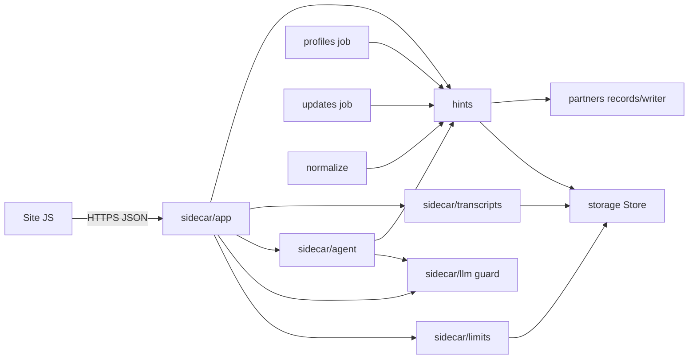
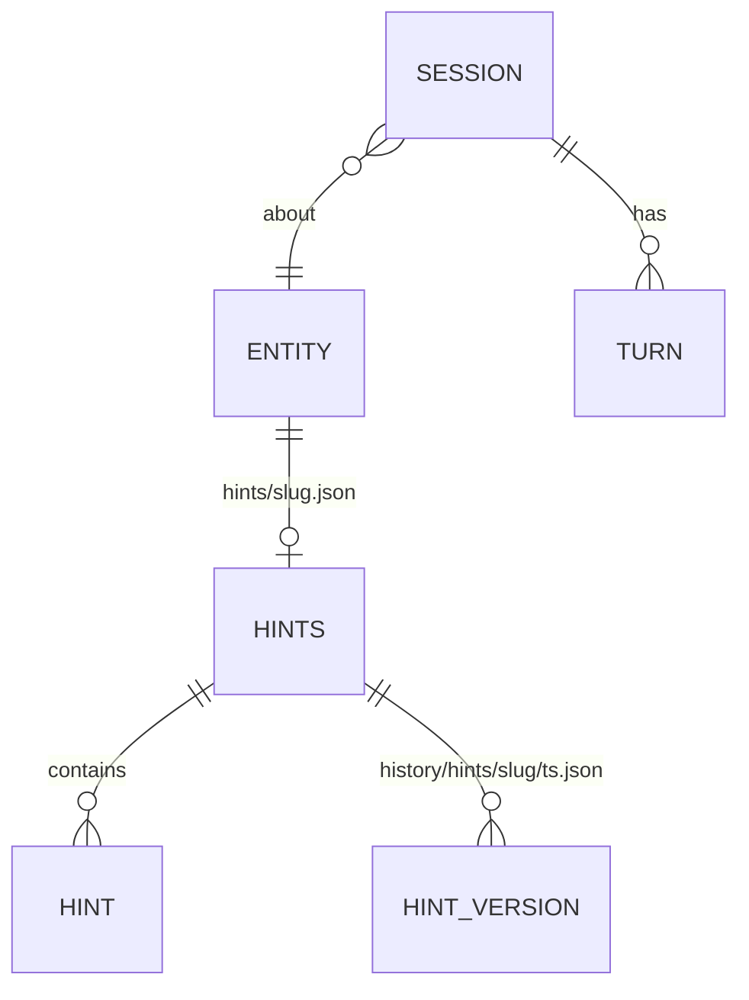

<!-- CLASI: Before changing code or making plans, review the SE process in CLAUDE.md -->

# Architecture Update -- Sprint 044: Update-agent sidecar and scraping hints

## What Changed

### New modules

| Module | Purpose (one sentence) | Boundary | Use cases |
|---|---|---|---|
| `partner_scrape/hints/` | Defines, validates and stores per-entity scraping hints. | Inside: hint schema, kind validation, on-domain rule, `HintStore`/`HintWriter`, pure helpers the scraper uses to read hints. Outside: LLMs, HTTP, redirect fetching (injected). | SUC-002,4,6 |
| `partner_scrape/sidecar/app` | Exposes the update-chat HTTP API. | Starlette routes, CORS, error mapping, session lifecycle. No model calls or storage logic directly. | SUC-001..005 |
| `partner_scrape/sidecar/llm` | Wraps the guard and agent model calls behind Protocols. | `GuardClient` (Anthropic default, OpenRouter optional) and `AgentClient`; real and fake implementations. | SUC-002,3 |
| `partner_scrape/sidecar/agent` | Runs one conversational turn that edits proposed hints via a tool. | System prompt, entity context builder, tool schema, tool dispatcher onto `hints` validation. | SUC-002 |
| `partner_scrape/sidecar/limits` | Enforces rate, size, turn and spend limits. | Per-IP/per-listing sliding windows (memory), message/turn caps, daily spend counter (persisted), Turnstile verifier (injected). | SUC-005 |
| `partner_scrape/sidecar/transcripts` | Persists session transcripts privately. | Writes `history/update-sessions/<ts>-<slug>-<id>.json`; IP salted hash. | SUC-001,5 |

### Modified modules

- `profiles/` reads page hints (about/contact/other) to override discovery.
- `updates/` passes note/identity hints to the proposer prompt; identity counts as rebrand evidence only alongside existing redirect/title evidence; policy untouched. Report lists hints used and event-source page hints.
- `normalize/` drops events matching a partner's exclude hints and counts them in the run log.
- `pyproject.toml`: optional extra `sidecar` (starlette, uvicorn); dev adds httpx for `TestClient`.
- Root `docker-compose.yml`: second service `updates`; new `scraper/docker/Dockerfile.sidecar`.

### Diagram

Dependency graph is acyclic: `app -> {limits, llm, agent, transcripts, hints}`, `agent -> {llm, hints}`, `hints -> {storage, partners}`. Scraper jobs depend on `hints` only for reads. Nothing in `hints` depends on the sidecar or on jobs. App fan-out is 5 (at the limit; justified as it is the composition root).

### Data model

Hints file: `{slug, version, updated, hints:[{kind, ...}]}`. Kinds: `page {role: about|contact|events|camps|programs|other, url}` (URL host must equal or be a subdomain of the entity's website domain(s)); `exclude {match, reason}` (substring, or `re:` prefixed regex with a length cap and compile check); `note {text}` (length-capped); `identity {name?, website?}` (new website accepted only if fetching the record's current website redirects to that host, verified at write time via an injected fetcher). Max hints per kind enforced.

Storage (private, no public-read): `hints/<slug>.json`; `history/hints/<slug>/<ts>.json`; `history/hints/changes.jsonl` (actor `update-agent:<session>`); `history/update-sessions/<ts>-<slug>-<id>.json`; `state/update-spend/<YYYY-MM-DD>.json`.

### HTTP API contract (for the site sprint, issue 84)

Base `https://updates.jtlapp.net`. JSON in and out, `Content-Type: application/json`. CORS allows only configured origins (`UPDATES_ALLOWED_ORIGINS`, comma-separated; methods GET/POST/OPTIONS). No cookies; the unguessable session id (192-bit) is the capability.

- `GET /healthz` -> `200 {"status":"ok","version":"..."}`.
- `POST /v1/sessions` body `{"type":"partner|opportunity|team|club|place","slug":"...","turnstile_token":"..."?}` -> `201`:
  `{"session_id","entity":{"type","slug","name","partner_slug"},"hints":[...],"proposed_hints":[...],"limits":{"max_message_chars","max_turns"},"turns_left","fallback_email","greeting"}`.
- `POST /v1/sessions/{id}/messages` body `{"text":"..."}` -> `200`:
  `{"reply","proposed_hints":[...],"status":"active|ended","ended_reason":null|"guard|turn_cap","turns_left","notices":["rejected: ..."]}`. When `status` is `ended` the reply is the polite message with the email fallback.
- `POST /v1/sessions/{id}/confirm` -> `200 {"saved":true|false,"hints":[...],"effective":"next scheduled scrape"}` (`saved:false` when proposed equals current).
- `GET /v1/sessions/{id}` -> `200` same shape as session start plus `status` and `messages:[{role,text}]`.
- Errors: HTTP status with `{"error":{"code","message","fallback_email"}}`. Codes: `bad_request` 400, `not_found` 404, `session_expired` 410 (idle > 30 min or service restart), `session_ended` 409, `message_too_long` 413, `rate_limited` 429 (with `Retry-After`), `spend_cap_reached` 503, `turnstile_failed` 403, `upstream_unavailable` 502.

### Controls

CORS origin allow-list; per-IP and per-listing sliding windows (memory, single replica; restart resets, documented); `max_turns` default 12, `max_message_chars` default 1000; daily spend cap (`UPDATES_DAILY_SPEND_USD`) from token usage x price table, persisted per UTC day in the history store so restarts keep it; Turnstile enforced only when `TURNSTILE_SECRET` is set; IP stored only as `sha256(salt + ip)` (salt from secrets bundle, never logged); the agent receives the entity record, latest profile snapshot summary and recent scraped events as read-only context; user text is delimited as untrusted.

### Deployment

Second service `updates` in stack `stem-ecosystem`: image `ghcr.io/league-infrastructure/stem-ecosystem-updates:${TAG}`, `networks: [caddy]` (external), `secrets: stem-ecosystem_updates_secrets` (base64 bundle: DO Spaces keys, ANTHROPIC_API_KEY, optional OPENROUTER_API_KEY, TURNSTILE_SECRET, IP_HASH_SALT) loaded by the same `load-secrets` pattern, `deploy.labels` `caddy: updates.jtlapp.net` and `caddy.reverse_proxy: "{{upstreams 8000}}"`, healthcheck on `/healthz`, no `ports`, one replica. Dockerfile is a slim Python base (no Chromium).

## Why

Issue 83. Keeping a hint a pure steering signal preserves the invariant that every published fact comes from the partner's own website, which makes automatic application of anonymous input safe. Reusing `partner_scrape` stores/writer keeps one history and audit mechanism.

## Impact on Existing Components

Scraper jobs gain a read-only dependency on `hints`; all consumption points degrade to current behavior when no hints file exists. `updates/policy.py` is unchanged. Image size of the scraper is unchanged (sidecar extra not installed there). Compose file gains a service; the scraper service is unchanged.

## Migration Concerns

None for data (hints are new keys). Deployment order: create the swarm secret, push image, then deploy the stack. Existing `TAG` mechanism builds both images from the same version.

## Design Rationale

- **Decision**: Separate `hints/` package rather than placing hint code in the sidecar. **Context**: Scraper jobs and the service both need it. **Alternatives**: Duplicate in each; put under `partners/`. **Why**: Keeps scraper from importing the web service and avoids a cycle. **Consequences**: One more package.
- **Decision**: Sessions in memory, transcripts persisted each turn. **Alternatives**: Redis/DB. **Why**: Single replica, low volume, no new infrastructure. **Consequences**: Restart gives `session_expired`; limits reset on restart (spend does not).
- **Decision**: Spend persisted in the history store. **Why**: The cost cap is the hard safety net. **Consequences**: Read-modify-write races are tolerable with one replica.
- **Decision**: Event-source page hints reported, not auto-sourced. **Why**: Keeps scope modest; the planner chooses. **Consequences**: A follow-up decides on generic sources.
- **Decision**: Tool-only hint editing with server-side validation as the authority. **Why**: Model output is never trusted; UI shows exactly what would be saved.

## Open Questions

1. Auto-created generic source for partners with events/camps/programs hints: deferred; confirm with Eric if wanted next sprint.
2. Entity resolution for team/club/place requires a lookup from entity slug to partner/website; confirm the data files that carry this during ticket 002 (fallback: return `not_found` with the email fallback).
3. Hints for non-partner entities are stored but not consumed by the scraper until a follow-up.
4. Price table for the spend estimate must be kept in step with model pricing (config constant).

## Architecture Self-Review

- Consistency: Sprint changes match body; deployment and API sections agree with scope. OK.
- Codebase alignment: `PartnerWriter`/`Store` patterns, `run-job` and `load-secrets` reused; profiles/updates/normalize hook points exist (checked module layout). Exact normalize hook point confirmed in ticket 006.
- Design quality: each module passes the one-sentence cohesion test; no cycles; app fan-out 5 justified as composition root; infrastructure (LLM, store, fetcher, Turnstile) injected.
- Anti-patterns: no god component (app delegates); speculative generality limited to the optional OpenRouter guard, explicitly requested; no shared mutable state beyond owned in-memory limiter.
- Risks: cost abuse (mitigated by spend cap and limits), prompt injection (guard, tool-only edits, validation, hints cannot supply facts), redirect verification SSRF (fetch only the record's existing website host, reject private IPs), single-replica state loss (documented).
- **Verdict: APPROVE WITH CHANGES** (confirm normalize hook point and entity resolution data source during tickets 006 and 002).
