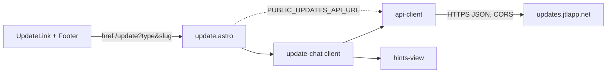

# Architecture Update -- Sprint 045: Update page and request-update links on the site

## What Changed

| Module | Purpose | Boundary | Use cases |
|---|---|---|---|
| `src/components/UpdateLink.astro` | Renders the "Request an update" block for one listing. | Inside: markup, href building (base-aware). Outside: page data. | SUC-001 |
| Footer link | General entry to `/update`. | Edit to Footer.astro. | SUC-002 |
| `src/pages/update.astro` | Static shell: explainer, email fallback, listing picker, chat/hints containers. | No API calls. Emits listing index as inline JSON. | SUC-002,5 |
| `src/lib/updates/api-client.mjs` | Typed fetch wrapper for the sidecar API. | Pure; `fetch` and base URL injected; maps error codes to a normalized error object. | SUC-003-005 |
| `src/lib/updates/hints-view.mjs` | Formats hints into readable labelled lines. | Pure, no DOM. | SUC-003 |
| `src/scripts/update-chat.ts` (client) | DOM glue: wires form, transcript, card, confirm, focus/aria-live. | Only module touching DOM; uses the two lib modules. | SUC-003-005 |

Lib modules are plain `.mjs` so `node --test` (scripts/test/) can import them without a build step.

No data-model changes. The dependency graph is acyclic: glue -> {client, view}; page -> glue; links -> page by URL only.

Config: `PUBLIC_UPDATES_API_URL` (Astro env, default `https://updates.jtlapp.net`) is inlined at build time and passed to the client via a data attribute. The API contract is the one in sprint 044's architecture-update (sessions, messages, confirm, GET; error codes bad_request, not_found, session_expired, session_ended, message_too_long, rate_limited with Retry-After, spend_cap_reached, turnstile_failed, upstream_unavailable). Session id is kept in memory (and sessionStorage for reload recovery via GET).

Mapping: partner -> type partner (slug from partner record; the route param is a numeric id, so the slug is read from the data); opportunity -> link to its partner's slug as type partner (per issue 84, "resolved to its partner"), team -> team_id, club -> club_id, place -> place_id.

## Why

Issue 84: the sidecar needs a front end; keeping logic in pure modules makes the API/hint behavior testable without a browser framework.

## Impact on Existing Components

Detail pages and footer gain one include each. package.json `test` glob already covers scripts/test; tests importing from src/lib work. No new runtime dependency. CORS already allows the site origins and localhost:4322/4323.

## Migration Concerns

None. Not deployed this sprint (manual deploy workflow).

## Design Rationale

- **Decision**: Plain client script plus pure lib modules, no UI framework. **Alternatives**: React/Preact island. **Why**: Site is static Astro with no framework; the UI is one form and one list. **Consequences**: Manual DOM updates, kept small.
- **Decision**: Opportunities link as partner type. **Why**: Issue 84. Consequence: opportunity-specific issues are described in chat.
- **Decision**: Render all server text with textContent, never innerHTML. **Why**: reply and hints are model-derived.

## Open Questions

1. Where the partner slug comes from in the site data (partners.json fields) — confirm in ticket 001; the sidecar keys partners by partners/<slug>/partner.json slug.
2. Whether team/club/place data files expose ids the sidecar expects (team_id etc.) — confirm in ticket 001.
3. Turnstile widget deferred while off server-side.

## Architecture Self-Review

- Consistency: body matches changes. Codebase alignment: pages and footer exist as assumed; "Discovery Lab" is a place record (places.json), no separate page type, so nothing extra. Design: each module has one purpose, no cycles, DOM isolated to one module. Anti-patterns: none; risks: model text injection (textContent), slug mismatch (open questions 1-2, verified live in ticket 004).
- **Verdict: APPROVE WITH CHANGES** (resolve open questions 1-2 in ticket 001).
