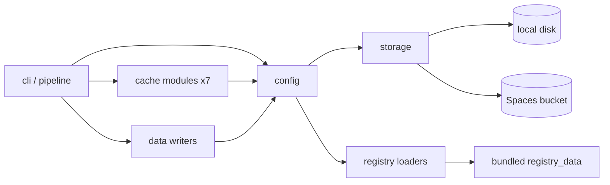

<!-- CLASI: Before changing code or making plans, review the SE process in CLAUDE.md -->

# Architecture Update -- Sprint 038: Bucket-backed storage and pip-installable package

## Step 1: Problem

Cache, published data and registry locations are tied to local disk and to the repo checkout. See sprint.md. Current state (verified): no storage abstraction; seven cache modules use pathlib directly; `export/partner_log.py` holds the only atomic write helper; `config.py` has `REPO_ROOT`, `DEFAULT_SITE_DIR`, `DEFAULT_OWN_DATA_DIR`; loaders default to `REPO_ROOT/registry/...`.

## Steps 2-3: Responsibilities and modules

| Module | Purpose (one sentence) | Boundary | Use cases |
|---|---|---|---|
| `storage.py` (new) | Read and write keyed bytes at a local or S3 location. | Inside: Store protocol, LocalStore (atomic writes), S3Store, `store_from_location`. Outside: any knowledge of cache or data layout, any env/config access. | SUC-001, 002 |
| `config.py` (changed) | Resolve every location and credential setting to a Store or Path. | Inside: env parsing, lazy shared boto3 client, defaults. Outside: key layout. | SUC-001, 002, 004 |
| Cache modules (7, changed) | Each owns its own key layout (folder constant + filename) over a Store. | Inside: key construction, JSON shape. Outside: transport. | SUC-001 |
| Data writers (changed) | Emit published JSON/images to the data Store with identical keys. | Inside: serialization, content types. | SUC-002 |
| Bundled registry (`partner_scrape/registry_data/`, moved from root `registry/`) | Default source/hub/candidate/ad definitions shipped in the wheel. | Overridable by a registry-dir setting. | SUC-004 |
| CI / packaging (workflows, pyproject) | Run, build, smoke-test and publish. | | SUC-002, 004 |

## Step 4: Diagrams

Dependency graph: cache modules and writers -> storage (leaf, no outward project deps). config -> storage. No cycles. `storage.py` must not import config (config builds Stores and injects the boto client).

Bucket layout: as in issue 50 (`cache/{hosts,enrichment,programs,descriptions,sponsors,sitemaps,partner_log}`, `data/...`).

## Step 5: What Changed / Why / Impact / Migration

**What changed**
- New `partner_scrape/storage.py`; `boto3` runtime dep, `moto[s3]` dev dep.
- Atomic write helper moves from `export/partner_log.py` into LocalStore.
- `config.py`: `get_scrape_cache_store()`, `get_data_store()` (`PARTNER_SCRAPE_DATA_DIR`, default the bucket `data/` prefix; `SCRAPE_CACHE_DIR` likewise defaults to the bucket `cache/` prefix), `DO_SPACES_ENDPOINT/ACCESS_KEY/SECRET_KEY`, registry/ads/candidates/hubs/site-dir settings; `REPO_ROOT` and `DEFAULT_*` repo-relative constants removed.
- Cache folder renames per issue 50; program cache key includes profile.
- Writers and `yield-history.json` state go through the data Store; `EventImageDownloader` takes store + prefix.
- Root `registry/` moves into the package; `data/` leaves git; SCHEMA.md source moves to `docs/data-schema.md`.
- Workflows: scheduled-run (no actions/cache, no git publish, `contents: read`, DO_SPACES secrets), new smoke-test and publish workflows.

**Why**: SUC-001..005.

**Impact**: Constructors keep `cache_dir: Path | None` (wrapped in LocalStore) so most tests are unchanged. `teams/` and `directory/` registries/data are already package-relative and need no move. Tests using `DEFAULT_*` paths follow the moved registry.

**Migration**: Old-layout local caches simply miss. Bucket was pre-uploaded. Ordering: git removal of `data/` only after real-bucket verification (ticket 008). Cache-key schema: profile addition makes old program-cache entries miss (acceptable). Stakeholder decision: NO legacy-key read fallback; the ~67 pre-uploaded profile-less `programs/` entries miss once and are re-extracted.

## Step 6: Design rationale

1. **Direct Store vs sync-around-run**: stakeholder decision. Consequence: network on every cache access; mitigated by keeping `Path` constructors for tests.
2. **Default locations are the bucket** (stakeholder decision): `SCRAPE_CACHE_DIR` defaults to `s3://jtl-stem-ecosystem-scrape/cache` and `PARTNER_SCRAPE_DATA_DIR` to `s3://jtl-stem-ecosystem-scrape/data`; a local dir is used only when set explicitly. Consequences: missing `DO_SPACES_*` credentials with an s3 location must fail loudly with an actionable message; tests must never reach the real bucket (autouse conftest fixture sets both to tmp_path, plus a guard that fails if an S3Store is built against the real bucket without moto).
3. **Bundled registry (option c)** with `PARTNER_SCRAPE_REGISTRY_DIR` override: the override is a location string resolved by config, so a later phase can point it to `s3://.../config` once a loader accepts a Store; not implemented now.
4. **S3Store prefix + shared client**: client built lazily in config, injected; thread safe.
5. **SCHEMA.md publication from a wheel-bundled copy** (hatch force-include of `docs/data-schema.md`): source stays in docs/ per stakeholder, yet the published run can find it when pip-installed.
6. **Profile in program key** done now, same change as the folder rename (keys change once).

## Step 7: Open questions

- RESOLVED by stakeholder: profile in program cache key, no legacy fallback, one-time re-extraction of ~67 entries accepted.
- DECIDED by stakeholder 2026-10-02: partner-scrape will NOT be published to PyPI; the package code moves later into a consolidated repo (with stem-ecosystem). Wheel smoke test is kept; publishing workflow dropped (ticket 013). SITE_REPO_TOKEN will not be provisioned for the same reason.
- RESOLVED by stakeholder: SCHEMA.md bundled into the wheel via hatch force-include.
- `requires-python >=3.13`: verify need in ticket 012.
- DESIGN.md files in the wheel: keep (decide in 012).

## Architecture self-review

- Consistency: Sprint Changes match body. PASS.
- Codebase alignment: verified facts per the lead's exploration; cache modules already take `cache_dir`. PASS.
- Design quality: storage is a cohesive leaf; config is the only place that reads env. config fan-out grows (storage, boto3) but stays under 5. PASS.
- Anti-patterns: shotgun surgery risk across 7 cache modules and 8 writers is inherent to the rename; mitigated by splitting tickets per area and keeping key constants local to each module. config.py could become a god-settings module; mitigated by keeping it declarative. Speculative generality: the registry override is a string setting only, no bucket loader.
- Risks: S3 latency per cache read in the 100-source run (note concurrency/threads); credentials in logs; `yield-history.json` read-modify-write has no locking (single scheduled writer assumed); region/endpoint misconfiguration (bucket-qualified endpoint) - add validation.
- Stakeholder decision recorded: no legacy-key fallback for the program cache.
- Added risk: bucket defaults mean an unconfigured test or dev run could write to production; mitigated by autouse tmp_path fixture and guard.
- Verdict: APPROVE WITH CHANGES (all changes resolved).
